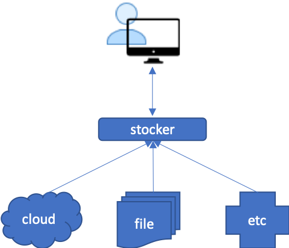

# stocker
Stock prices procurer. This API takes care of sourcing out stock prices and returns the queried prices to the caller.
This doesn't persist the data so information is always live as of source (cloud, file, other systems, etc). Analytics and other data manipulation should be handled by [vertx-reactive api](https://github.com/chiusday/samples/tree/master/vertx-reactive) 

## Overview:

